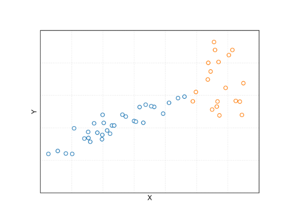

# Техническая часть

### БД

##### Задача SQL WB

Даны 2 таблицы.
Таблица подневных продаж:

* 'dt'-- отчетный день
* 'seller_id'-- идентификатор продавца
* 'category_id'-- идентификатор категории товара (платье, подгузники и тп)
* 'sale_price'-- конечная цена товара для покупателя

Таблица подневных остатков на складах:

* 'dt'-- отчетный день
* 'seller_id'-- идентификатор продавца
* 'category_id'-- идентификатор категории товара (платье, подгузники и тп)
* 'stock_price'-- конечная цена товара для покупателя
* 'stock_id'--id склада

Необходимо вывести топ 5 селлеров по продажам за последние 3 мес, остатки на складах которых на актуальную дату выше, чем среднедневные продажи за прошедшие 3 мес.

### Python

##### Задача python WB

Дан массив названий файлов формата number_str.extension. Отсортировать его в порядке возрастания по числу (number) и в порядке убывания по лексикографическому порядку по строке (str).

```python
file_names= [
 '01_a.txt',
 '1_c.txt',
 '10_b.txt',
 '2_bb.txt',
 '3_c.txt',
 '2_a.txt'
]
```

##### Задача алгоритмическая WB

Дан массив nums уникальных положительных целых чисел размера N.
Функция random(k: int), возвращающая случайное целое число из множества {0,1,2,...,k-1}. (функция уже реализована).
Требуется распечатать все элементы массива nums в случайном порядке, используя функцию random.
Распечатанные элементы не должны повторяться.еоретическая часть

##### Задача алгоритмическая Точка

Есть строка симовлов надо преобразовать ее так, чтобы после каждого символа выводилось кол-во этого символа идущего подряд, если символ встречается 1 раз, то число выводить не надо.
Примеры: "AABDDFFFGC" ->  "A2BD2F3GC"

# Теоретическая часть

### ML-дизайн

##### Задача LTV WB

Необходимо получить прогноз выручки (LTV) к 180-му дню жизни пользователя

**Контекст**

Мобильное приложение (F2P игра)
Два вида монетизации:

* реклама
* inapp (покупки в игре)

##### Задача recsys WB

Мы работаем в онлайн-кинотеатре. Нужно разработать систему рекомендаций в новом разделе "Специально для вас".

### Вопросы по ML

* Включается ли нулевой коэффициент в l1 или l2-регуляризацию?
* На графике синими точками указана обучающая выборка, рыжыми тестовая. Как на тестовой выборке будут вести себя алгоритмы: Линейная регрессия, Random Forest, KNN.



* Написать на python решение квадратного уравнения a * x**2 + b * x + c = 0, используя градиентный спуск.
